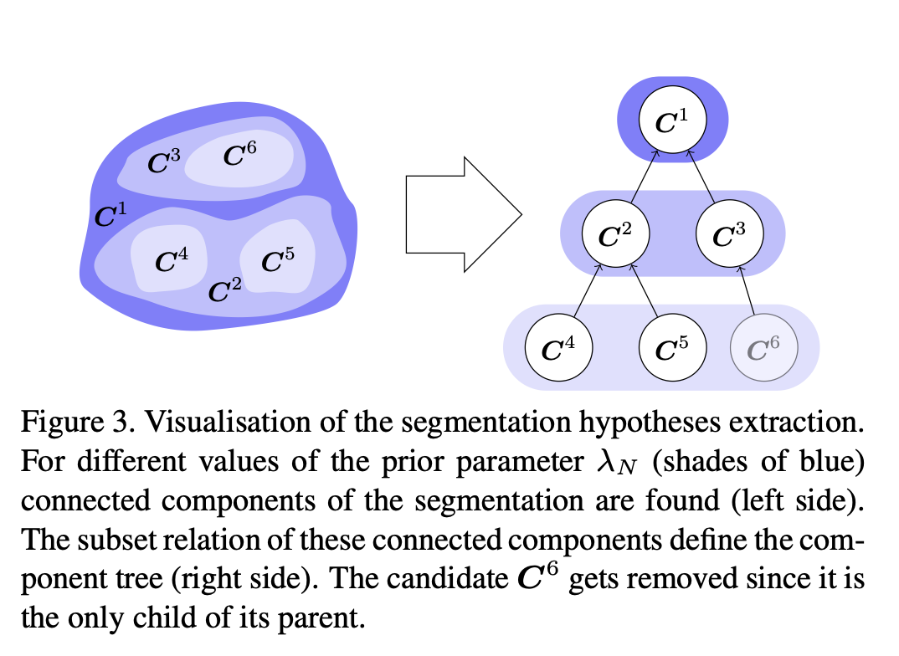

(From [Funke et al, 2012](https://ieeexplore.ieee.org/document/6247777)) 
>"To begin with, we generate different segmentation hypotheses for each slice of the volume individually, i.e., without consideration of the spatial context in the z-direction. This is achieved by a sequence of parameterized graph cut segmentations. Then, all possible assignments of these segmentation hypotheses, between each pair of consecutive slices, are enumerated and represented by binary assignment variables. Each possible continuation, branching, and end of a neuron is explicitly represented by an assignment variable of its own. To keep the number of variables low, we discard assignments between candidates with an x-y displacement that is above a certain threshold, assuming a coarse registration of the volume. An assignment cost function that is pre-trained on positive samples gives the costs for selecting an assignment variable. The final segmentation of the slices and assignments between them are jointly found as the optimal solution to an integer linear program".

The authors proposed a strategy for performing 3d neuron instance segmentation - they approach this by associating segmentations obtained from 2d slices. For each slice, they generate a hierarchy of segmentations. This hierarchy is obtained in a parameterized manner. For example, by changing the value of a certain binary thresholding parameter, one can obtain different regions of the foreground, which can be separated into individual instances using connected components. This implies that for each value of the binary threshold parameter, one would get a different instance segmentation. These different hypotheses can be arranged into a dendrogram/tree. For each z slice, the authors thus produce a dendrogram. Then the problem becomes to find a subset of associations across these dendrograms that would explain the whole 3d volume.

>"Therefore, we propose to extract a set of possible connected components that might represent neuron sections. These connected components, that we will call segmentation hypotheses in the following, are allowed to overlap and thereby contradict each other. Thus, we increase the scale of ambiguity from pixels to larger regions. It remains to find consistent subsets of segmentation hypotheses. We show how this can be done with consideration of all slices at once."

In order to reduce the number of hypotheses, the authors give preference to having larger segmentations and discard hypotheses if a node has only one leaf. 

>"To reduce the number of segmentation hypotheses, we propose to discard segmentation hypotheses that are already well represented by others and do not introduce a new interpretation of the image. In particular, we are not interested in only children of the component trees , i.e., components that are the only child of their parent. These segmentation hypotheses are the only subset of their parent and therefore carry the same information on a smaller set of pixels. In other words, if there are different conflicting segmentation hypotheses with the same topological properties, we choose the consider the biggest one only."

<figure></figure>

The authors use two sets of constraints - (i) every pixel should be assigned to only one label (hypothesis consistency constraint) and (ii) a segmentation hypothesis which was picked from an assignment to a previous slice will also be picked by an assignment to the next slice (explanation consistency constraint), since it ensures a continuous sequence of assignments 

I wonder if this would be extended for the task of tracking, what formulation is needed to enumerate the merging, splitting, mitosis etc. Maybe splitting cost could conserve volume. If we define $I$ as the set of pixels belonging to the $i^{th}$ segmentation hypothesis, then

$$
c^{i \rightarrow j,k} := \big\lVert |I| - \overline{|J| + |K|} \big\rVert, 
$$

where $c^{i \rightarrow j, k}$ indicates the cost of $i^{th}$ segmentation hypothesis splitting to give $j^{th}$ and $k^{th}$ segmentation hypotheses. Similarly, one could define a merging cost.

Since the mitosis should be defined differently to distinguish from a splitting event, maybe one could conserve mass? 
If we define $F_{i}$ as the intensity of the set of pixels belonging to the $i^{th}$ segmentation hypothesis, then

$$
c_{m}^{i \rightarrow j,k} := \big\lVert \sum F_{i} - \overline{\sum F_{j} + \sum F_{k}} \big\rVert, 
$$

where $c_{m}^{i \rightarrow j,k}$ denotes the cost of the $i^{th}$ segmentation hypothesis dividing to give the $j^{th}$ and $k^{th}$ segmentation hypotheses. 

One could potentially normalize the costs above. For example, 

$$
c^{i \rightarrow j,k} := 2\frac{\big\lVert |I| - \overline{|J| + |K|}\big\rVert}{|I| + |J| + |K|}, 
$$

These costs are obviously non-learnt. If we had some supervision in the form of manually annotated lineage trees, then context aware features and costs can be framed. 
